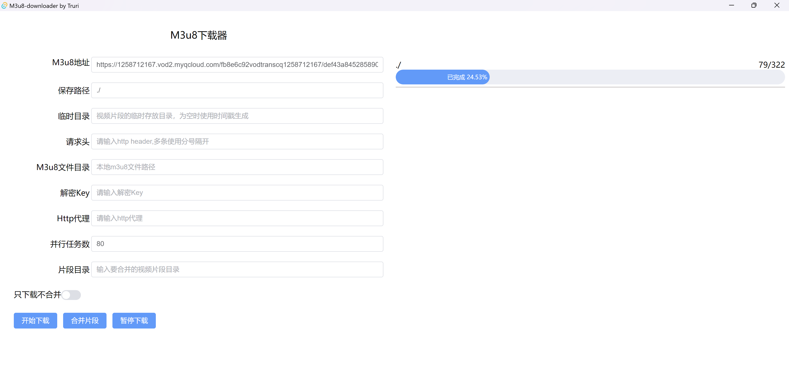

# 0. 开始

偶然间看到了 Rust 觉得这个语言觉得很有意思，做个东西练练手。


很多视频网站的视频都是m3u8格式的，想下载下来看，虽然市面上有很多很强大的下载器，如IDM、迅雷、XDM等，他们都做得很出色，但是因为种种原因，有些文件是主动不提供下载的。M3u8解析起来也比较简单，就作为Rust语言的练习


此项目基于Tauri和原命令行项目包装而成，也支持在终端直接使用命令行运行。命令行项目地址

Github: https://github.com/ying001ch/m3u8-downloader

Gitee: https://gitee.com/ying001ch/m3u8-downloader

# 支持功能

1. 使用地址下载
2. 使用m3u8文件下载
3. 指定请求头
4. 指定解密key
5. 使用http代理
6. 指定并行任务数
7. 合并已下载的视频片段（调用FFMPEG）
8. 显示进度条和 已下载/总片段 数量
9. 支持暂停和恢复


# 编译安装

编译前端代码

```shell
# 先进入前端目录
cd m3u8front3/
# 安装依赖
npm install
# 编译代码
npm run build
```

然后回到根目录，编译rust后端部分

```shell
# 回到项目根目录
cd {project_root}
# 编译rust部分
cargo build --release
```

合并视频片段使用FFMPEG，需要事先下载并且设置环境变量 `FFMPEG_PATH`

```shell
FFMPEG_PATH="/ffmpeg/bin"
```
# 运行截图
